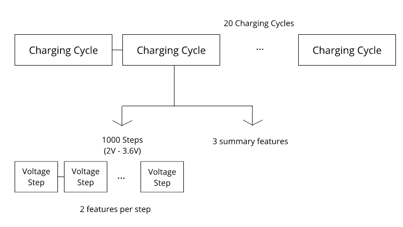
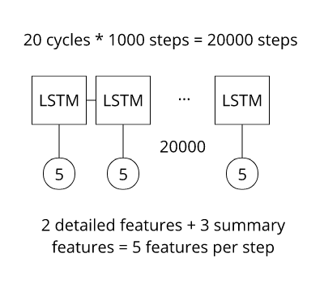
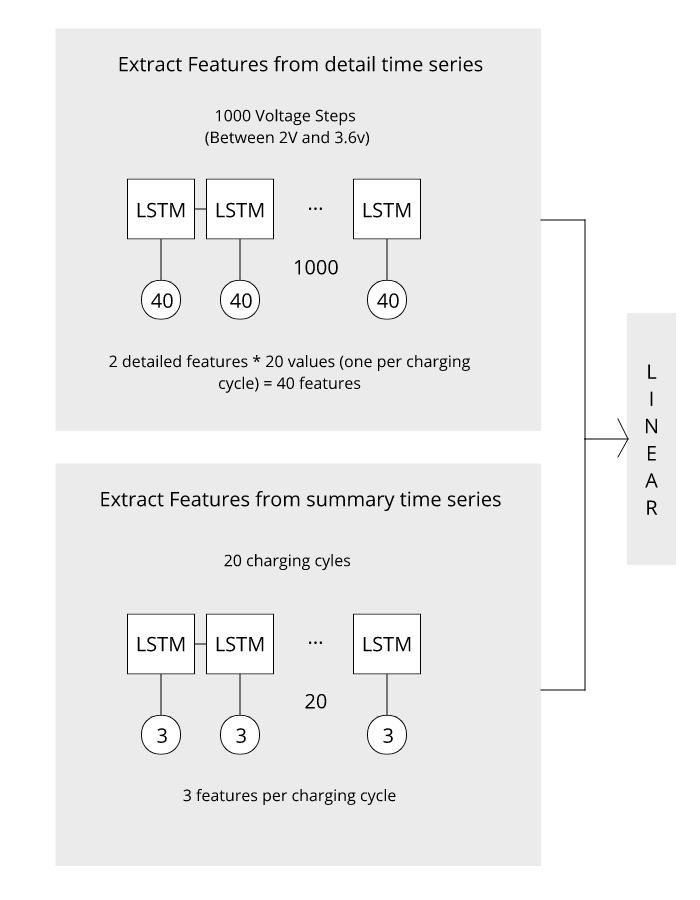
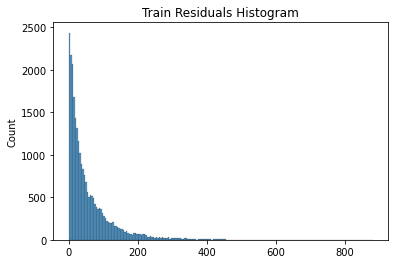
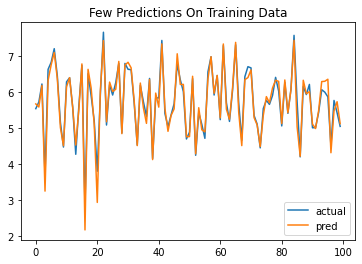
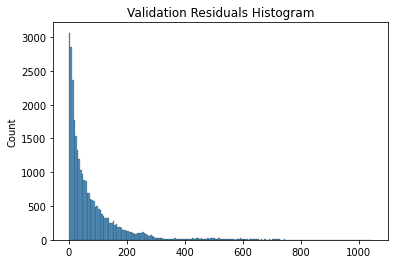
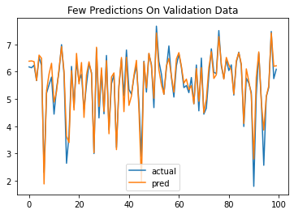

# Battery Second Use

After a few years of usage ev batteries become unfit for use in evs, 
these batteries either don't hold enough charge to offer reasonable driving range,
or supply low discharge current. There are three options for these batteries

**1. Recycle** Lithium, Copper and other metals can be extracted from the battery. The extracted metals could be used for manufacturing of new batteries.

**2. Reuse** These batteries can be used in less demanding applications, such as batteries for storing energy generated from renewables, or battery storage for electric grid.

**3. Dump** If the above options are not available or there is no incentive for above options battery could end up in trash.

Which of these options will dominate depends on factors such as cost benefits, new battery supply, old battery supply, compatibility of batteries, regulations regarding reuse/recycling, etc.

# Get Started

| Notebook | Colab Link | Description |
| --- | -- | -- |
| 01-extract-data  | [](https://colab.research.google.com/github/breathingcyborg/battery-cycle-life-prediction/blob/main/01-extract-data.ipynb) | Run this notebook before running other notebooks this notebook downloads data, transforms data and saves it to google drive |
| 02-explore-data | [](https://colab.research.google.com/github/breathingcyborg/battery-cycle-life-prediction/blob/main/02-explore-data.ipynb) | Understand data, understand fast charging, find good features and implementation of model used by d3batt group |
| 03-train-voltage-as-timesteps | [](https://colab.research.google.com/github/breathingcyborg/battery-cycle-life-prediction/blob/main/03-train-voltage-as-timesteps.ipynb) | make and train model that uses second modeling approach mentioned above |

# Goal
Before batteries are repaired and deployed for second use, we need information about how many cycles would this battery last. If battery is in good condition is could be used for moderate load applications otherwise it could be used for low load applications.

The repo provides machine learning model that predicts how many cycles the battery could last.

# Battery Basics

Before solving the problem it's necessary to understand the problem. Here are some resources that helped me understand about batteries and battery aging.

* [Battery Jargon](https://web.mit.edu/evt/summary_battery_specifications.pdf)
* [C Rate](https://www.youtube.com/watch?v=4qIYyaRKGVE)
* [How fastcharging works](https://www.youtube.com/watch?v=A6mKd5_-abk&t=2060s)
* [Factors affecting battery aging](https://www.mpoweruk.com/life.htm)
* [State of charge / State of health](https://www.biologic.net/topics/battery-states-state-of-charge-soc-state-of-health-soh/)

# How cycle life is predicted (Experimental Setup).

* Cells are inserted into arbin potentiostat inside chambers that maintain 30C temperature.
* Cells go through fast charging and discharging for 20 cycles.
* Current, Voltage, QCharge, QDicharge, Temperature, Internal Resistance are measured.
* The measured values are fed to machine learning model that predicts remaining cycle life of battery.

For details visit [data.matr.io](https://data.matr.io/1/projects/5c48dd2bc625d700019f3204)

# Data

Open source [dataset](https://data.matr.io/1/projects/5c48dd2bc625d700019f3204) used by research paper titled  [Data-driven prediction of battery cycle life before capacity degradation](https://data.matr.io/1/projects/5c48dd2bc625d700019f3204) was used. The authors of this paper were working as part of toyota research group for battery materials (d3batt). Their goal was to accelerate testing of batteries and to optimize fast charging of batteries.

The data is like a nested time series.



For each charging-discharging cycle we have

1) 1000 measurements of QDischarge and TDischarge. As cell discharges its voltage drops from 3.6V to 2V, 3.6V-2V range is divided into 1000 steps and these quanties are measured for each of these voltage steps. The gaps are filled by linear interpolation.

2) One value for features like chargetime, internal resistance, average temperature.


# Modeling approach

We have 20 charging cycles. For each cycle we have 2 features having 1000 measurements, and 3 features having 1 measurement. There are multiple ways to feed this data to a machine learning model.

## 1. Single Time Series Regression



We can think of this data as single time series, with 20 cycles and 1000 steps per cycle we have total 20000 steps. Two detail features have 1000 values for charging cycle, but 3 summary features have just one value, so we'll keep their value same for entire charging cycle (1000 steps). In total we would have 5 features per timestep and 20000 time steps.

Any model that can work with time series can be used to perform regression on this time series.

The drawback of this approach is since the time series is extremely long model fails to learn long term dependencies. To reduce loss it cheats by predicting the mean of lifecycles and does not learn anything.

## 2. Voltage steps not time steps (Used Here)



Instead of time steps we can think of data as having voltage steps. We have 1000 voltage steps in 2V-3.6V range. The values of features in each charging cycle can be interpreted as feature. This instead of seeing timeseries as `(20000 steps, 2 features)` we see it as `(1000 steps, 40 features)` this makes time series shorter and thus easier to learn. 

If we look at features of single voltage step it will look like this 
```
[
   TDischarge Cycle 1, TDischarge Cycle 2, ... , TDischarge Cycle 20,
   QDischarge Cycle 1, QDischarge Cycle 2, ... , QDischarge Cycle 20
]
```

We extract features from voltage series for detailed features, combine that with features we extract from time series of summary features and pass it to fully connected network.

## 3. Time series model in loop.

We extract features from each charging cycle by running timeseries model in loop. The following psuedocode illustrates that.

```
features = []
for each charging cycle
  feature = time_series_model(charging_cycle)
  features.append(feature)
```

The extracted features are combined with summary features. This approach is used by this [medium article](https://towardsdatascience.com/predicting-battery-lifetime-with-cnns-c5e1faeecc8f)

## 4. Others
There are lots of others ways like using simple linear regression model with hand crafted features. Extracting features from time series using Tsfresh, Catch22, or Rocket(random convolution) etc.


# Results

Models predictions are good except for peaks and valleys, peak show brand new cells, and valleys show cells that have reached end of life. 

## Train Set

### Report
```
mean_absolute_error          57.786537
root_mean_square_error       90.318970
r_squared                     0.936635
max_error                   882.436218
observations              25830.000000
```
### Residuals Histogram


### Sample Prediction


## Validation Set

### Report

```
mean_absolute_error          78.637405
root_mean_square_error      130.918839
r_squared                     0.897482
max_error                  1049.312744
observations              29454.000000
```

### Residuals Histogram


### Sample Prediction


# Limitations

The data was collected from brand new cells, thus calendar aging effect is absent from data. And the predictions are for cells not for battery packs.

# References

* [Data-driven prediction of battery cycle life before capacity degradation](https://data.matr.io/1/projects/5c48dd2bc625d700019f3204) Paper which Provides the data.
* [Paper Supplementary Info](https://static-content.springer.com/esm/art%3A10.1038%2Fs41560-019-0356-8/MediaObjects/41560_2019_356_MOESM1_ESM.pdf) for reference.
* [Toyata Research For Battery Materials](https://data.matr.io/)
* [Predicting battery lifetime with CNN](https://towardsdatascience.com/predicting-battery-lifetime-with-cnns-c5e1faeecc8f) the article that used the third modeling approach mentioned above.
